# 레트로 아케이드 게임 오픈소스 조사 및 단일 HTML 변환 가능성 평가

> **작성 목적**: 추억의 오락실 게임 중 오픈소스로 공개된 웹 구현체를 조사하고, 각각을 외부 의존성 없는 단일 HTML 파일로 변환할 수 있는지 코드 구조 분석을 통해 평가한다.
>
> **실행 환경 주의**: 이 문서의 모든 항목은 저장소 코드 구조 분석 기반으로 평가되었으며, 실제 브라우저 실행 확인은 이루어지지 않았다.

---

## 목차

1. [퍼즐 장르](#1-퍼즐-장르)
2. [슈팅 장르](#2-슈팅-장르)
3. [플랫포머 장르](#3-플랫포머-장르)
4. [벨트스크롤 액션 장르](#4-벨트스크롤-액션-장르)
5. [기타 아케이드 장르](#5-기타-아케이드-장르)
6. [⚠️ 원작 저작물 포함 저장소 (별도 주의)](#6--원작-저작물-포함-저장소-별도-주의)
7. [종합 요약 및 추천](#7-종합-요약-및-추천)

---

## 1. 퍼즐 장르

### 1-1. jakesgordon/javascript-tetris

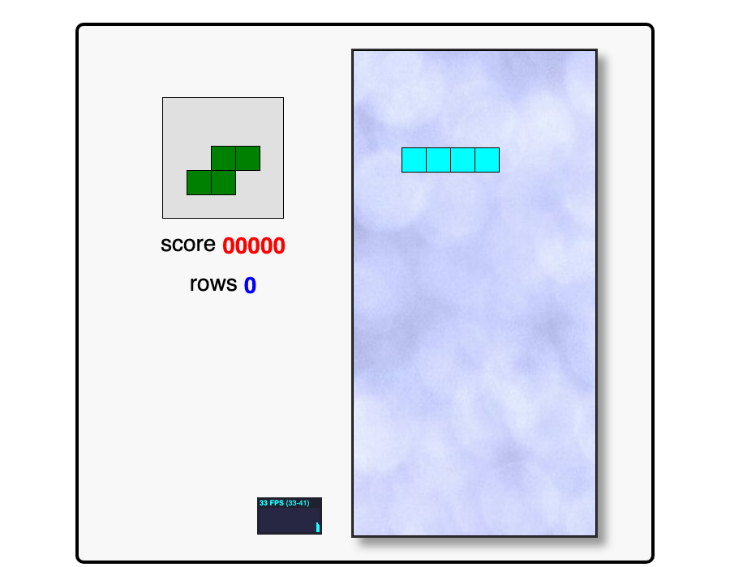

| 항목 | 내용 |
|------|------|
| **게임 이름** | JavaScript Tetris |
| **원작과의 관계** | 테트리스 클론 (1984 Alexey Pajitnov 원작) |
| **저장소 URL** | https://github.com/jakesgordon/javascript-tetris |
| **라이선스** | MIT |
| **기술 스택** | 순수 JS/Canvas, 빌드 불필요, 외부 프레임워크 없음 |
| **에셋 현황** | `index.html`(~18KB), `stats.js`(4KB), `texture.jpg`(44KB) — 3개 파일 |
| **단일 HTML 변환 난이도** | **하** |
| **난이도 근거** | `index.html` 자체가 이미 게임 로직 대부분을 포함. `stats.js`는 인라인 삽입 가능, `texture.jpg`는 Base64 인코딩으로 인라인 처리하면 완전한 단일 파일 완성. 빌드 단계 없음 |
| **장르 태그** | 퍼즐, 낙하형 블록 |

---

### 1-2. notsoround/tetris-2026

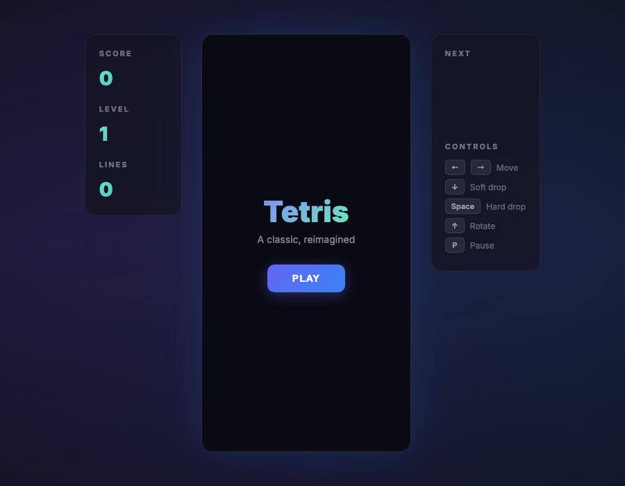

| 항목 | 내용 |
|------|------|
| **게임 이름** | Tetris 2026 |
| **원작과의 관계** | 테트리스 클론 — "외부 의존성 없이 브라우저에서 바로 실행"을 목표로 제작 |
| **저장소 URL** | https://github.com/notsoround/tetris-2026 |
| **라이선스** | 불명 (라이선스 파일 없음) |
| **기술 스택** | 순수 JS/Canvas, 완전 단일 HTML 파일 (`index.html` ~17KB) |
| **에셋 현황** | `index.html` 1개 파일만 존재 |
| **단일 HTML 변환 난이도** | **하** |
| **난이도 근거** | 이미 단일 HTML 파일 — 추가 변환 작업 없음. 단, 라이선스 불명확으로 상업/배포 사용 시 주의 필요 |
| **장르 태그** | 퍼즐, 낙하형 블록 |

---

### 1-3. dionyziz/canvas-tetris

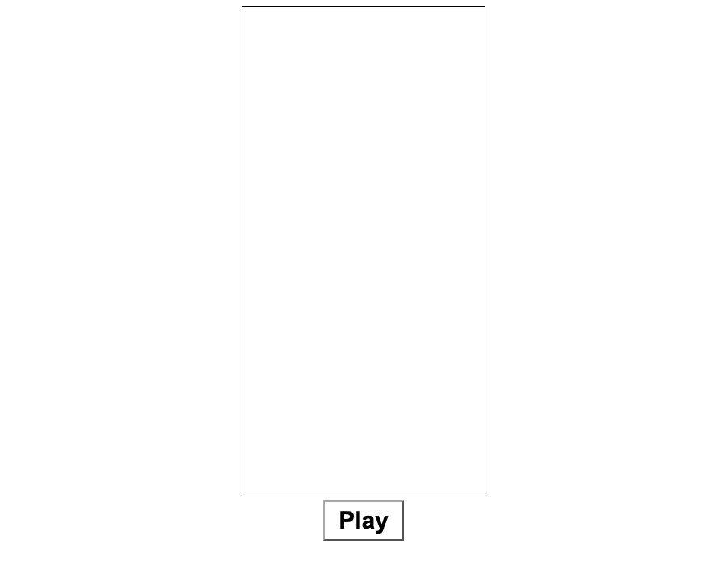

| 항목 | 내용 |
|------|------|
| **게임 이름** | Canvas Tetris |
| **원작과의 관계** | 테트리스 클론 (HTML5 Canvas 학습 목적) |
| **저장소 URL** | https://github.com/dionyziz/canvas-tetris |
| **라이선스** | MIT |
| **기술 스택** | 순수 JS/Canvas + 별도 CSS, 여러 JS 모듈 파일 분리 |
| **에셋 현황** | `index.html`, `style.css`, `/js/` 디렉토리(다수 JS), `/sound/` 디렉토리(사운드 파일들) |
| **단일 HTML 변환 난이도** | **중** |
| **난이도 근거** | JS 파일들은 `<script>` 인라인으로 합치기 쉬우나, `/sound/` 폴더의 오디오 파일을 Base64로 인라인 처리하는 작업이 필요. 빌드 시스템은 없음 |
| **장르 태그** | 퍼즐, 낙하형 블록 |

---

### 1-4. gabrielecirulli/2048

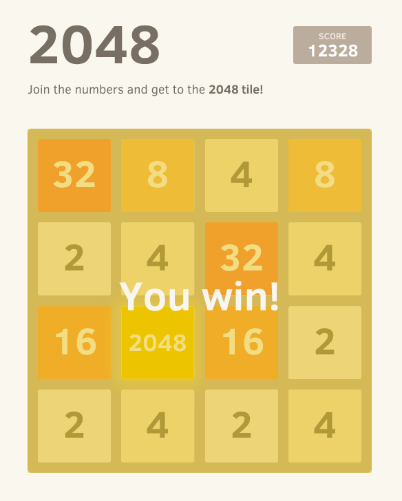

| 항목 | 내용 |
|------|------|
| **게임 이름** | 2048 |
| **원작과의 관계** | 2048 퍼즐 게임 원작 (2014, Gabriele Cirulli) — 슬라이딩 타일 퍼즐 |
| **저장소 URL** | https://github.com/gabrielecirulli/2048 |
| **라이선스** | MIT |
| **기술 스택** | 순수 JS + CSS3 애니메이션, 여러 JS 모듈 분리 (`/js/` 폴더) |
| **에셋 현황** | `index.html`, `/js/`(다수 JS), `/style/`(CSS 파일들), `favicon.ico` |
| **단일 HTML 변환 난이도** | **중** |
| **난이도 근거** | 이미지/사운드 외부 에셋 없음. JS와 CSS를 인라인으로 합치는 작업만 필요. 빌드 시스템 없음. 비교적 단순한 모듈 구조 |
| **장르 태그** | 퍼즐, 슬라이딩 타일 |

---

### 1-5. n-nagmn/puyo_mobile

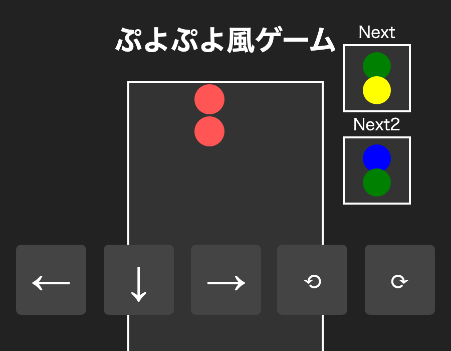

| 항목 | 내용 |
|------|------|
| **게임 이름** | Puyo Mobile |
| **원작과의 관계** | 뿌요뿌요 스타일 클론 (Compile/SEGA 원작 유사 장르) — 모바일 터치 지원 |
| **저장소 URL** | https://github.com/n-nagmn/puyo_mobile |
| **라이선스** | MIT |
| **기술 스택** | 순수 JS/Canvas, 완전 단일 HTML 파일 (`puyo_mobile.html` ~16KB), 모바일 터치 지원 |
| **에셋 현황** | `puyo_mobile.html` 1개 파일만 존재 |
| **단일 HTML 변환 난이도** | **하** |
| **난이도 근거** | 이미 단일 HTML 파일 — 추가 변환 작업 없음. MIT 라이선스로 자유로운 수정 가능 |
| **장르 태그** | 퍼즐, 낙하형 연결 퍼즐, 뿌요뿌요류 |

---

### 1-6. shjang1007/puyo-puyo

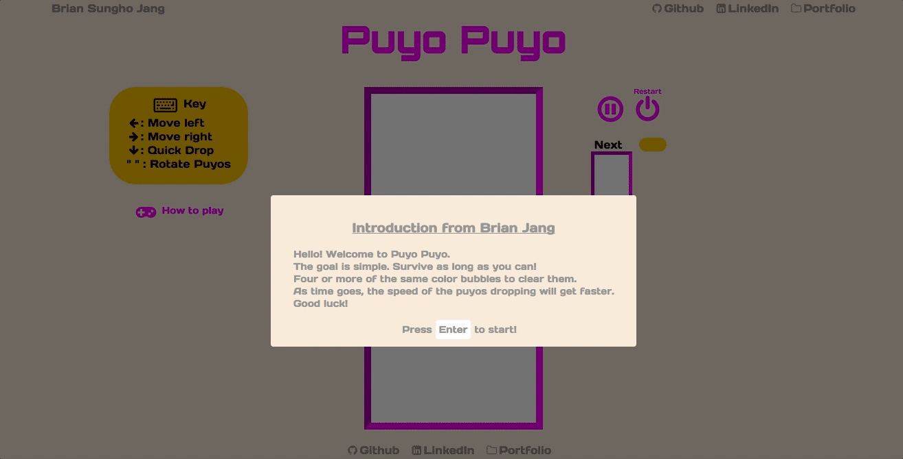

| 항목 | 내용 |
|------|------|
| **게임 이름** | Puyo-Puyo |
| **원작과의 관계** | 뿌요뿌요 클론 (HTML5 Canvas + Webpack 기반) |
| **저장소 URL** | https://github.com/shjang1007/puyo-puyo |
| **라이선스** | 불명 (라이선스 파일 없음) |
| **기술 스택** | Webpack 번들러 사용, 다수 JS 모듈, `/css/`, `/img/`, `/sound/`, `/lib/`, `/font-awesome/` 폴더 |
| **에셋 현황** | `bundle.js`(22KB 번들), `index.html`, CSS, 이미지, 사운드, 폰트어섬 라이브러리 |
| **단일 HTML 변환 난이도** | **중** |
| **난이도 근거** | `bundle.js`는 이미 번들된 상태라 인라인 삽입 가능. 단, 이미지·사운드·폰트어섬 에셋은 Base64 인라인 처리 필요. 라이선스 불명 |
| **장르 태그** | 퍼즐, 낙하형 연결 퍼즐, 뿌요뿌요류 |

---

## 2. 슈팅 장르

### 2-1. hoorayimhelping/Galaga5

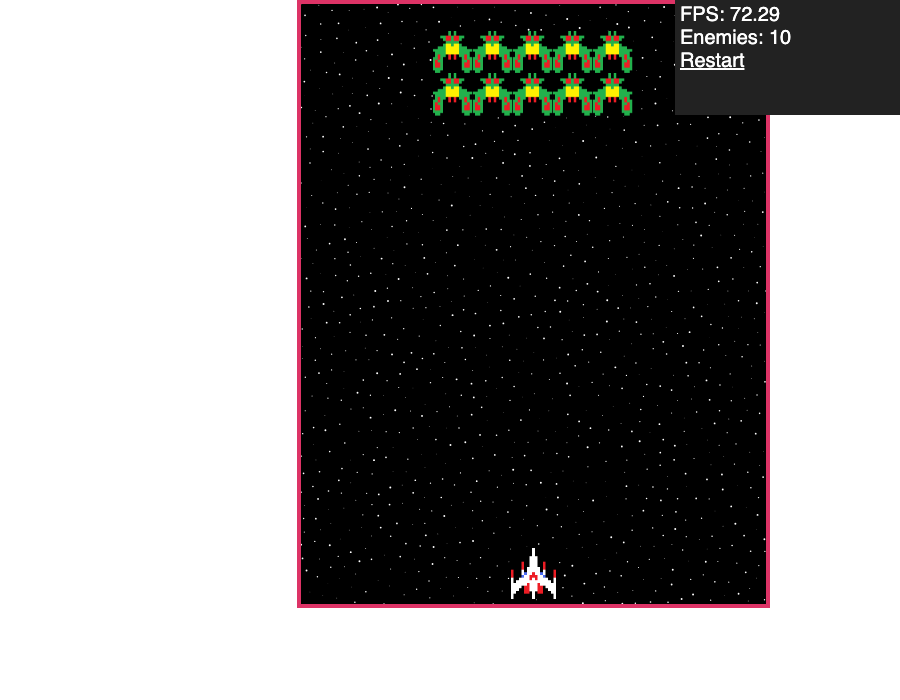

| 항목 | 내용 |
|------|------|
| **게임 이름** | Galaga5 |
| **원작과의 관계** | 갤러그 클론 (Namco 1981 원작) — HTML5 Canvas 구현 |
| **저장소 URL** | https://github.com/hoorayimhelping/Galaga5 |
| **라이선스** | 불명 (라이선스 파일 없음) |
| **기술 스택** | 순수 JS/Canvas, jQuery 의존, 다수 독립 JS 파일 분리 |
| **에셋 현황** | `index.html`, `galaga.css`, `jquery.js`(84KB), 다수 `.js` 파일들(Characters, Enemy, GameEngine 등), `/img/` 폴더(스프라이트 이미지) |
| **단일 HTML 변환 난이도** | **중** |
| **난이도 근거** | JS 파일 수가 많지 않고(~10개) 빌드 시스템 없음. jQuery 인라인 포함, 이미지를 Base64로 처리하면 변환 가능. 단, 라이선스 불명 |
| **장르 태그** | 슈팅, 고정형 슈터, 갤러그류 |

---

### 2-2. jwilliams219/galaga

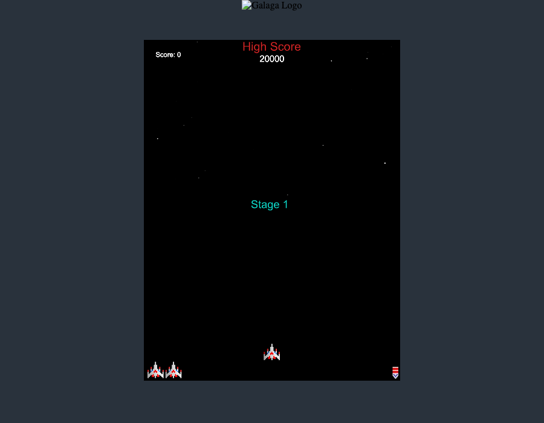

| 항목 | 내용 |
|------|------|
| **게임 이름** | Galaga (JS) |
| **원작과의 관계** | 갤러그 클론 (Namco 1981) |
| **저장소 URL** | https://github.com/jwilliams219/galaga |
| **라이선스** | 불명 (라이선스 파일 없음) |
| **기술 스택** | 순수 JS/Canvas, `/scripts/`, `/images/`, `/sounds/`, `/styles/` 분리 구조 |
| **에셋 현황** | `index.html`, `/scripts/`(JS 파일들), `/images/`(스프라이트), `/sounds/`(효과음), `/styles/`(CSS) |
| **단일 HTML 변환 난이도** | **중** |
| **난이도 근거** | 사운드 파일 포함으로 오디오 Base64 인라인 처리 필요. 이미지도 Base64 변환 필요. 빌드 시스템 없음. 라이선스 불명 |
| **장르 태그** | 슈팅, 고정형 슈터, 갤러그류 |

---

### 2-3. DavidHMoura/space-invaders-arcade

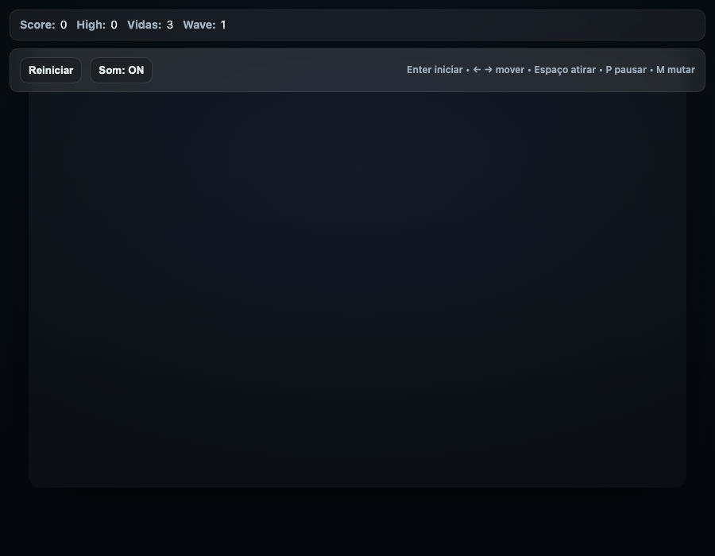

| 항목 | 내용 |
|------|------|
| **게임 이름** | Space Invaders Arcade |
| **원작과의 관계** | 스페이스 인베이더 클론 (Taito 1978 원작) — 순수 JS/Canvas 재구현 |
| **저장소 URL** | https://github.com/DavidHMoura/space-invaders-arcade |
| **라이선스** | 불명 (`LICENSE.txt` 파일이 비어 있음) |
| **기술 스택** | 순수 JS/Canvas, `/src/` 폴더 기반 모듈화, 별도 CSS |
| **에셋 현황** | `index.html`, `styles.css`, `/src/`(다수 JS 모듈) — 이미지/사운드 외부 에셋 없음 (Canvas 직접 드로잉) |
| **단일 HTML 변환 난이도** | **중** |
| **난이도 근거** | 이미지·사운드 외부 파일 없음(그래픽을 Canvas API로 직접 렌더링). JS 모듈과 CSS를 인라인 합치기만 하면 됨. 빌드 필요 없음 |
| **장르 태그** | 슈팅, 고정형 슈터, 스페이스 인베이더류 |

---

### 2-4. stefanmiroiu/Asteroids-Game

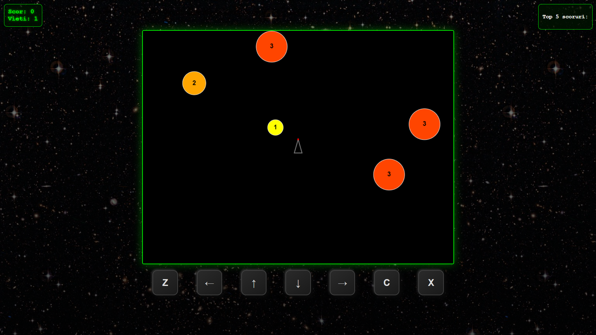

| 항목 | 내용 |
|------|------|
| **게임 이름** | Asteroids Game |
| **원작과의 관계** | 아스테로이드 클론 (Atari 1979 원작) — 모바일 터치 지원 포함 |
| **저장소 URL** | https://github.com/stefanmiroiu/Asteroids-Game |
| **라이선스** | 불명 (라이선스 파일 없음) |
| **기술 스택** | 순수 JS/Canvas, `script.js` 단일 JS 파일, 별도 CSS |
| **에셋 현황** | `index.html`, `script.js`(12KB), `styles.css`, `/media/`(배경음악·효과음) |
| **단일 HTML 변환 난이도** | **중** |
| **난이도 근거** | JS 파일 1개만 존재 — 인라인 삽입 매우 단순. `/media/` 오디오 파일들만 Base64로 처리하면 됨. 빌드 불필요. 라이선스 불명 |
| **장르 태그** | 슈팅, 전방향 슈터, 아스테로이드류 |

---

## 3. 플랫포머 장르

### 3-1. nebez/floppybird

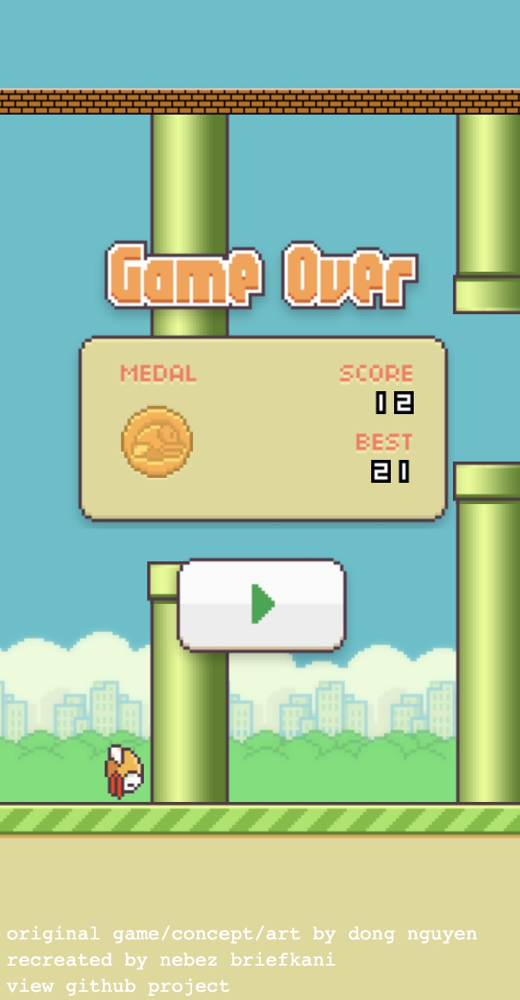

| 항목 | 내용 |
|------|------|
| **게임 이름** | Floppy Bird |
| **원작과의 관계** | Flappy Bird 클론 (Dong Nguyen 2013 원작 유사 장르) |
| **저장소 URL** | https://github.com/nebez/floppybird |
| **라이선스** | Apache 2.0 |
| **기술 스택** | TypeScript → JS 컴파일, CSS3 DOM 기반 애니메이션 (Canvas 미사용), `/assets/`(이미지·사운드), tsconfig.json |
| **에셋 현황** | `index.html`, `/js/`(컴파일된 JS), `/css/`, `/assets/`(이미지·오디오) |
| **단일 HTML 변환 난이도** | **중** |
| **난이도 근거** | TypeScript 소스는 있으나, 이미 컴파일된 JS 사용 가능. CSS DOM 기반 렌더링이므로 Canvas 게임보다 인라인 합치기 수월. 에셋 Base64 처리 필요. 사운드 파일 포함 |
| **장르 태그** | 플랫포머, 탭 조작, 플래피버드류 |

---

### 3-2. udacity/frontend-nanodegree-arcade-game

| 항목 | 내용 |
|------|------|
| **게임 이름** | Frogger-Style Arcade Game |
| **원작과의 관계** | 프로거 스타일 클론 (Konami 1981 프로거 유사 장르) — Udacity 교육 프로젝트 |
| **저장소 URL** | https://github.com/udacity/frontend-nanodegree-arcade-game |
| **라이선스** | MIT |
| **기술 스택** | 순수 JS/Canvas OOP, `/js/`(엔진+게임로직), `/css/`, `/images/` |
| **에셋 현황** | `index.html`, `/js/engine.js` + `/js/app.js` + `/js/resources.js`, `/css/style.css`, `/images/`(스프라이트 이미지들) |
| **단일 HTML 변환 난이도** | **중** |
| **난이도 근거** | JS 파일 3개, CSS 1개, 이미지 다수. 이미지를 Base64로 인라인 처리하면 완성. 빌드 시스템 없음. MIT 라이선스 |
| **장르 태그** | 플랫포머, 횡단 액션, 프로거류 |

---

### 3-3. RadianDev01/donkey-kong-game

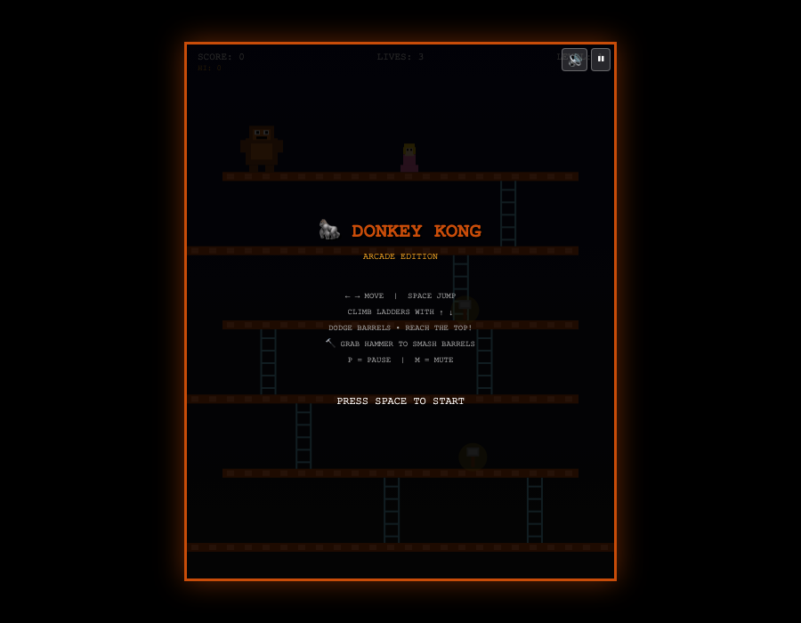

| 항목 | 내용 |
|------|------|
| **게임 이름** | Donkey Kong Arcade Game |
| **원작과의 관계** | 동키콩 클론 (Nintendo 1981 원작 영감) — 사운드는 Web Audio API 합성, 원작 에셋 미포함 |
| **저장소 URL** | https://github.com/RadianDev01/donkey-kong-game |
| **라이선스** | 불명 (라이선스 파일 없음) |
| **기술 스택** | 순수 JS/Canvas, Web Audio API (외부 사운드 파일 없음), 빌드 불필요 |
| **에셋 현황** | `index.html`(6KB), `game.js`(21KB) — 2개 파일, 이미지/사운드 모두 코드로 직접 생성 |
| **단일 HTML 변환 난이도** | **하** |
| **난이도 근거** | `game.js` 단 1개만 인라인 삽입하면 완성. 이미지·사운드 외부 파일 전혀 없음 (Canvas + Web Audio API로 완전 자체 렌더링). 빌드 불필요. 단, 라이선스 불명 |
| **장르 태그** | 플랫포머, 점프 액션, 동키콩류 |

---

## 4. 벨트스크롤 액션 장르

### 4-1. drewhamlett/DoubleDragon

> 게임 화면: 헤드리스 브라우저 실행 캡처 불가 (엔진 로딩 이슈)

| 항목 | 내용 |
|------|------|
| **게임 이름** | Double Dragon (HTML5) |
| **원작과의 관계** | 더블드래곤 클론 (Technōs Japan 1987 원작) — Impact.js 엔진 사용 |
| **저장소 URL** | https://github.com/drewhamlett/DoubleDragon |
| **라이선스** | 불명 (라이선스 파일 없음) |
| **기술 스택** | Impact.js 게임 엔진 의존, `/lib/impact/`, `/lib/game/main.js`, `/media/` 폴더(스프라이트·사운드) |
| **에셋 현황** | `index.html`(Impact.js 로더), `/lib/impact/impact.js`(엔진), `/lib/game/main.js`, `/media/`(다수 에셋), 또한 소켓IO 외부 URL 참조 포함 |
| **단일 HTML 변환 난이도** | **상** |
| **난이도 근거** | Impact.js 엔진(상용 라이선스) 의존성 + 다수 미디어 에셋 + 하드코딩된 소켓IO 외부 URL. 단일 HTML 변환을 위해서는 엔진 교체 혹은 Impact.js 전체 인라인화 + 에셋 Base64화 + 소켓IO 의존성 제거 필요. 사실상 재작성에 가까운 작업 |
| **장르 태그** | 벨트스크롤 액션, 격투 액션, 더블드래곤류 |

---

### 4-2. DCurrent/openbor

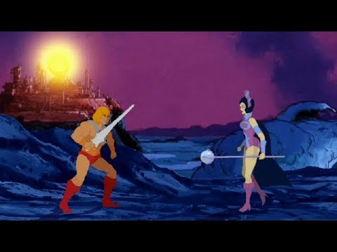

| 항목 | 내용 |
|------|------|
| **게임 이름** | OpenBOR (Beats of Rage 엔진) |
| **원작과의 관계** | Beats of Rage 엔진 (Sega의 Streets of Rage 게임플레이 구현 엔진) — 파이널파이트·더블드래곤류 팬게임 제작 플랫폼 |
| **저장소 URL** | https://github.com/DCurrent/openbor |
| **라이선스** | BSD 3-Clause (소스 코드) |
| **기술 스택** | C 언어 + SDL2, CMake 빌드 시스템, Emscripten으로 웹어셈블리 컴파일 가능 |
| **에셋 현황** | C 소스 코드 (`/engine/`), CMakeLists.txt, 게임 에셋은 별도 팩 파일로 배포 |
| **단일 HTML 변환 난이도** | **상** |
| **난이도 근거** | C/SDL2 기반으로 직접 JS 변환 불가. Emscripten을 통한 WebAssembly 빌드는 가능하나, 결과물이 단일 HTML 형태가 아닌 wasm + JS + HTML 세트로 출력됨. 게임 에셋도 별도 팩 필요. 게임 코드가 아닌 엔진이라 실제 게임 구현까지 추가 작업 대규모 |
| **장르 태그** | 벨트스크롤 액션, 격투 액션, 파이널파이트류, 엔진 |

---

## 5. 기타 아케이드 장르

### 5-1. masonicGIT/pacman

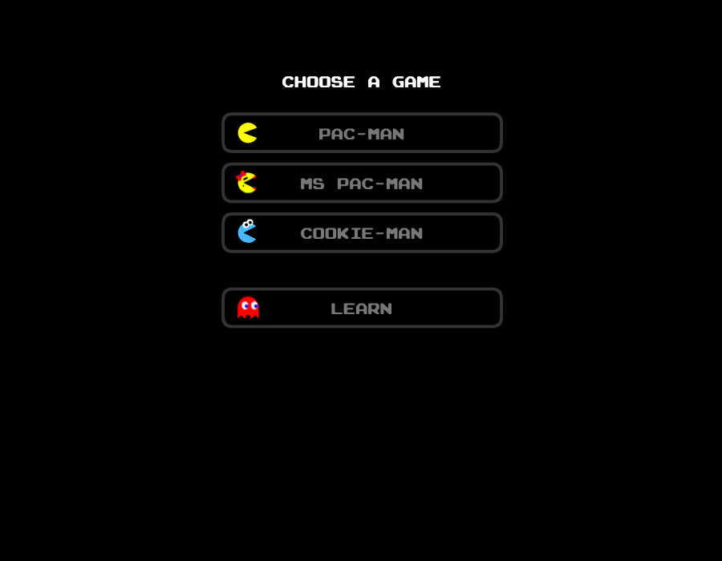

| 항목 | 내용 |
|------|------|
| **게임 이름** | Pac-Man |
| **원작과의 관계** | 팩맨 클론 (Namco 1980 원작) — 고충실도 구현, AI 동작 재현 |
| **저장소 URL** | https://github.com/masonicGIT/pacman |
| **라이선스** | GPL v3 |
| **기술 스택** | Next.js 프레임워크 기반, `pacman.js`(400KB 대형 파일), `/sprites/`, `/sounds/`, `/font/`, `/fruit/` 폴더 |
| **에셋 현황** | `index.html`, `next.config.js`, `package.json`, `pacman.js`(400KB), 다수 이미지·사운드·폰트 에셋 |
| **단일 HTML 변환 난이도** | **상** |
| **난이도 근거** | Next.js 빌드 시스템 필요. `pacman.js` 400KB 대형 파일 + 다수 스프라이트·사운드·폰트 에셋. 에셋 모두 Base64 인라인 처리 시 결과물이 수 MB가 될 수 있음. GPL v3로 사용 시 소스 공개 의무 존재 |
| **장르 태그** | 미로 탈출, 아케이드, 팩맨류 |

---

### 5-2. devferx/arkanoid-js

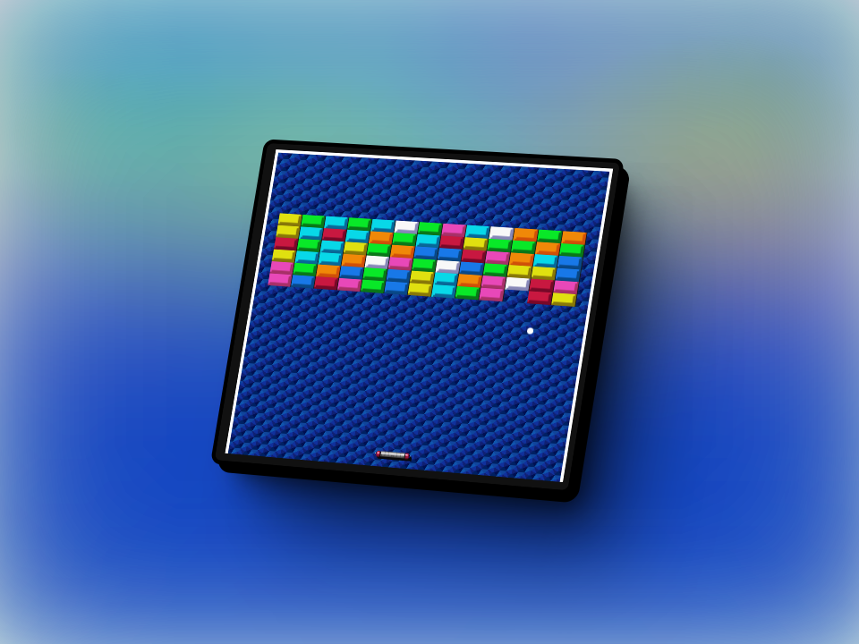

| 항목 | 내용 |
|------|------|
| **게임 이름** | Arkanoid JS |
| **원작과의 관계** | 아카노이드/브레이크아웃 클론 (Taito 1986 원작) |
| **저장소 URL** | https://github.com/devferx/arkanoid-js |
| **라이선스** | 불명 (라이선스 파일 없음) |
| **기술 스택** | 순수 JS/Canvas, 인라인 HTML 구조 (빌드 불필요) |
| **에셋 현황** | `index.html`(7KB, JS 포함), `sprite.png`(9KB), `bricks.png`(0.4KB), `bkg.png`(1KB) — 이미지 3개 |
| **단일 HTML 변환 난이도** | **하** |
| **난이도 근거** | JS가 이미 `index.html` 안에 포함. PNG 이미지 3개를 Base64로 인라인 처리하면 완전한 단일 파일 완성. 라이선스 불명 주의 |
| **장르 태그** | 슈팅(블록 깨기), 아케이드, 아카노이드류 |

---

### 5-3. MichaelKS123/Brick-Breaker

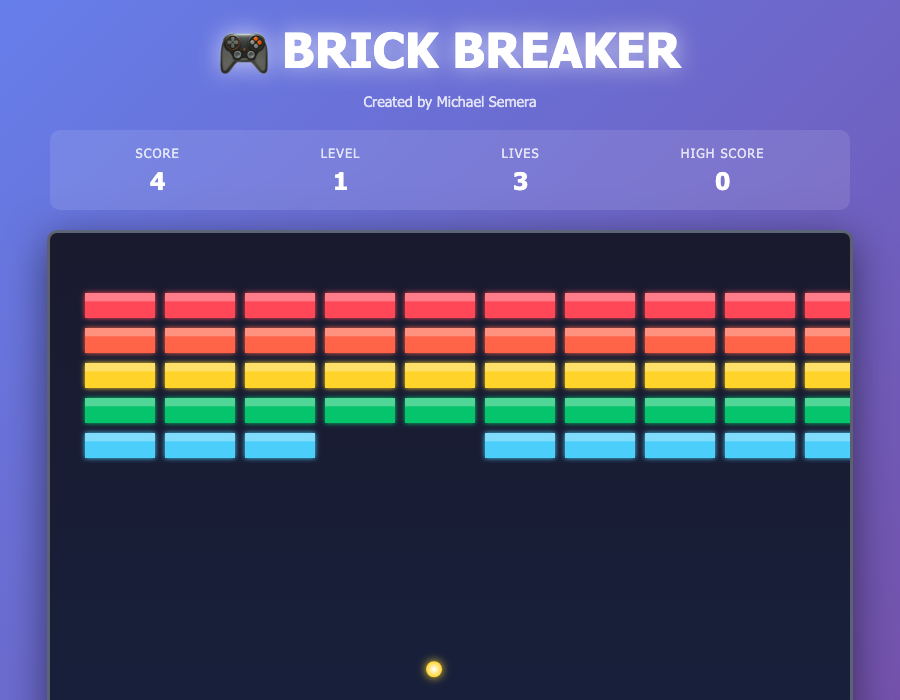

| 항목 | 내용 |
|------|------|
| **게임 이름** | Brick Breaker |
| **원작과의 관계** | 브레이크아웃 클론 (Atari 1976 → 아카노이드 유사 장르) |
| **저장소 URL** | https://github.com/MichaelKS123/Brick-Breaker |
| **라이선스** | 불명 (라이선스 파일 없음) |
| **기술 스택** | 순수 JS/Canvas, 완전 단일 HTML 파일 (`brick-breaker-game.html` ~21KB) |
| **에셋 현황** | `brick-breaker-game.html` 1개 파일만 존재 |
| **단일 HTML 변환 난이도** | **하** |
| **난이도 근거** | 이미 단일 HTML 파일 — 파일명만 변경하면 됨. 라이선스 불명 주의 |
| **장르 태그** | 슈팅(블록 깨기), 아케이드, 브레이크아웃류 |

---

### 5-4. codewithsadee/Snake-Game

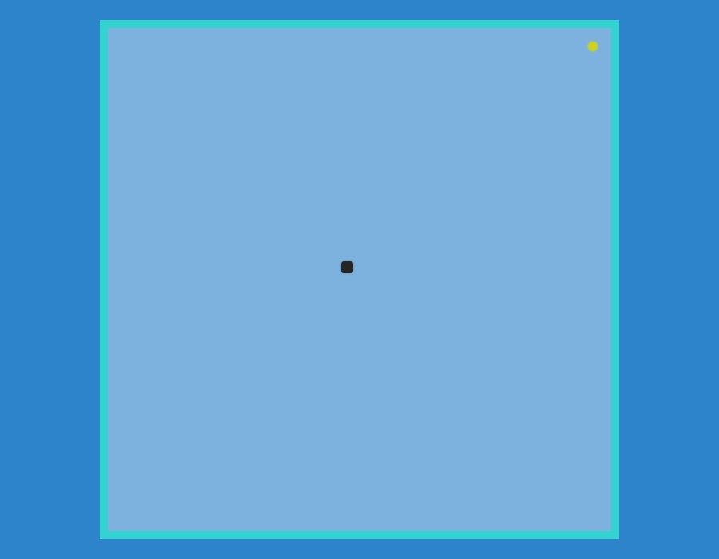

| 항목 | 내용 |
|------|------|
| **게임 이름** | Snake Game |
| **원작과의 관계** | 스네이크 게임 클론 (Nokia 피처폰 유행 1990~2000년대) |
| **저장소 URL** | https://github.com/codewithsadee/Snake-Game |
| **라이선스** | 불명 (라이선스 파일 없음) |
| **기술 스택** | 순수 JS/Canvas, 다수 JS 모듈 분리 (`food.js`, `grid.js`, `input.js`, `script.js`, `snake.js`) |
| **에셋 현황** | `index.html`, `style.css`, 다수 JS 파일, `snake.png`(5KB 이미지 1개) |
| **단일 HTML 변환 난이도** | **중** |
| **난이도 근거** | JS 파일 5개 + CSS + 이미지 1개. 각각 인라인 처리하면 완성. 빌드 시스템 없음. 라이선스 불명 주의 |
| **장르 태그** | 아케이드, 탐식 액션, 스네이크류 |

---

## 6. ⚠️ 원작 저작물 포함 저장소 (별도 주의)

아래 저장소는 코드 자체는 오픈소스이나, **원작 게임의 저작물(스프라이트, 사운드, 음악 등)을 그대로 포함**하고 있어 법적 위험이 있다. 개인 학습·연구 목적 외 배포 시 주의가 필요하다.

---

### [별도] robertkleffner/mariohtml5

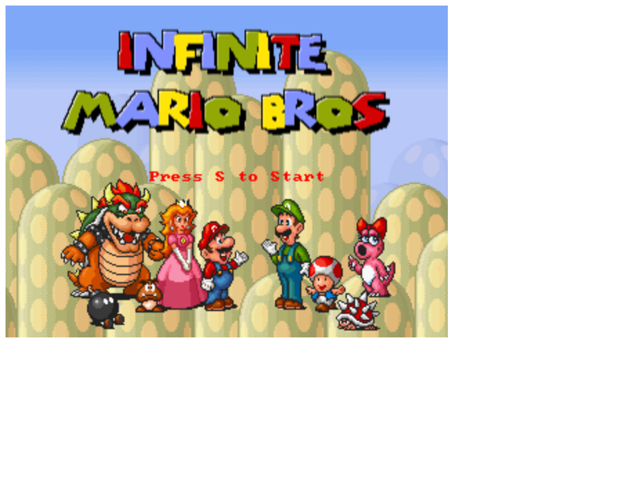

| 항목 | 내용 |
|------|------|
| **게임 이름** | Infinite Mario HTML5 |
| **원작과의 관계** | 슈퍼마리오 브라더스 클론 — Notch(Minecraft 제작자)의 Infinite Mario 포트, **닌텐도 스프라이트·사운드 포함** |
| **저장소 URL** | https://github.com/robertkleffner/mariohtml5 |
| **라이선스** | Unlicense (Public Domain) — 단, 포함된 닌텐도 에셋은 Nintendo 저작권 |
| **기술 스택** | 순수 JS/Canvas, `mario.min.js`(78KB 번들), `main.html`, `/images/`(닌텐도 스프라이트), `/sounds/`, `/midi/` |
| **에셋 현황** | `main.html`, `mario.min.js`(번들), `enjine.min.js`, `/images/`(원작 스프라이트), `/sounds/`(원작 효과음), `/midi/`(원작 BGM) |
| **단일 HTML 변환 난이도** | **중** (기술적으로) |
| **난이도 근거** | JS가 이미 번들된 상태(2개 .min.js). 이미지·사운드를 Base64 인라인 처리하면 기술적 단일 파일화는 가능. 단, **닌텐도 원작 에셋 포함으로 배포 시 저작권 침해 위험** |
| **장르 태그** | 플랫포머, 횡스크롤, 슈퍼마리오류 |
| **⚠️ 주의** | 코드는 Public Domain이나 `/images/`, `/sounds/`, `/midi/`의 에셋은 닌텐도 저작권. 개인 학습 목적에 한정 |

---

### [별도] ikhattab/space-invaders (CoffeeScript)

| 항목 | 내용 |
|------|------|
| **게임 이름** | Space Invaders (CoffeeScript) |
| **원작과의 관계** | 스페이스 인베이더 클론 (Mary Rose Cook의 강연 기반) |
| **저장소 URL** | https://github.com/ikhattab/space-invaders |
| **라이선스** | 불명 |
| **기술 스택** | CoffeeScript → JS 컴파일 필요, Canvas 기반 |
| **에셋 현황** | CoffeeScript 소스 파일, 원작 스프라이트 포함 여부 불명확 |
| **단일 HTML 변환 난이도** | **상** |
| **난이도 근거** | CoffeeScript 컴파일 단계 필요. 원작 그래픽 사용 시 저작권 문제 가능성 |
| **장르 태그** | 슈팅, 고정형 슈터, 스페이스 인베이더류 |
| **⚠️ 주의** | CoffeeScript 빌드 필요, 에셋 저작권 불명 |

---

## 7. 종합 요약 및 추천

### 단일 HTML 변환 난이도 분포

| 난이도 | 저장소 수 | 주요 이유 |
|--------|-----------|-----------|
| **하** (즉시 변환 가능) | 5개 | 이미 단일 파일이거나, 외부 에셋 2개 이하 |
| **중** (작업 수 시간) | 11개 | JS/CSS 인라인 + 이미지/사운드 Base64 처리 필요 |
| **상** (대규모 작업/불가) | 4개 | 빌드 시스템, 엔진 의존, C 언어 등 |

### 추천 저장소 (단일 HTML 변환 목적)

| 우선순위 | 저장소 | 장르 | 이유 |
|---------|--------|------|------|
| ⭐⭐⭐ | `n-nagmn/puyo_mobile` | 퍼즐 | MIT + 이미 단일 HTML, 모바일 지원 |
| ⭐⭐⭐ | `jakesgordon/javascript-tetris` | 퍼즐 | MIT + 이미지 1개만 처리하면 완성 |
| ⭐⭐⭐ | `RadianDev01/donkey-kong-game` | 플랫포머 | JS 1개 인라인, 외부 에셋 전혀 없음 |
| ⭐⭐⭐ | `devferx/arkanoid-js` | 블록 깨기 | JS 이미 인라인, 이미지 3개만 처리 |
| ⭐⭐⭐ | `MichaelKS123/Brick-Breaker` | 블록 깨기 | 이미 단일 HTML |
| ⭐⭐ | `gabrielecirulli/2048` | 퍼즐 | MIT + 이미지 없음, JS/CSS 인라인만 |
| ⭐⭐ | `DavidHMoura/space-invaders-arcade` | 슈팅 | 이미지 없음(Canvas 직접 렌더), JS 모듈만 합치면 됨 |
| ⭐⭐ | `udacity/frontend-nanodegree-arcade-game` | 플랫포머 | MIT + 구조 단순 |
| ⭐⭐ | `dionyziz/canvas-tetris` | 퍼즐 | MIT + 사운드 Base64 처리 필요 |
| ⭐⭐ | `nebez/floppybird` | 플랫포머 | Apache 2.0 + 컴파일된 JS 있음 |

### 스테이지 팝업 삽입 적합성

단일 HTML 변환 후 **스테이지 전환 시점에 교육 팝업을 삽입**하는 프로젝트 목적에 가장 적합한 저장소:

1. **`jakesgordon/javascript-tetris`** — 줄 제거(라인 클리어) 이벤트가 명확하여 팝업 삽입 시점 파악 쉬움
2. **`n-nagmn/puyo_mobile`** — 연쇄 처리 완료 시점에 팝업 삽입 가능
3. **`gabrielecirulli/2048`** — 타일 합성/목표 달성 이벤트에 팝업 삽입 적합
4. **`udacity/frontend-nanodegree-arcade-game`** — 라운드/레벨 구조가 명확하여 삽입 시점 파악 용이

---

### 라이선스 현황 요약

| 라이선스 | 해당 저장소 |
|---------|-----------|
| MIT | jakesgordon/javascript-tetris, dionyziz/canvas-tetris, gabrielecirulli/2048, n-nagmn/puyo_mobile, udacity/frontend-nanodegree-arcade-game |
| Unlicense (Public Domain) | robertkleffner/mariohtml5 (단, 에셋 저작권 별도) |
| Apache 2.0 | nebez/floppybird |
| GPL v3 | masonicGIT/pacman |
| BSD 3-Clause | DCurrent/openbor |
| **불명** | notsoround/tetris-2026, shjang1007/puyo-puyo, hoorayimhelping/Galaga5, jwilliams219/galaga, DavidHMoura/space-invaders-arcade, stefanmiroiu/Asteroids-Game, drewhamlett/DoubleDragon, devferx/arkanoid-js, MichaelKS123/Brick-Breaker, codewithsadee/Snake-Game, RadianDev01/donkey-kong-game, ikhattab/space-invaders |

> **라이선스 불명 저장소 사용 시 주의**: 명시적 라이선스가 없는 저장소는 기본적으로 저작권법상 저작권자의 허락 없이 사용·수정·배포가 제한된다. 개인 학습 목적에 한해 사용하거나, 저작권자에게 직접 문의하는 것을 권장한다.
